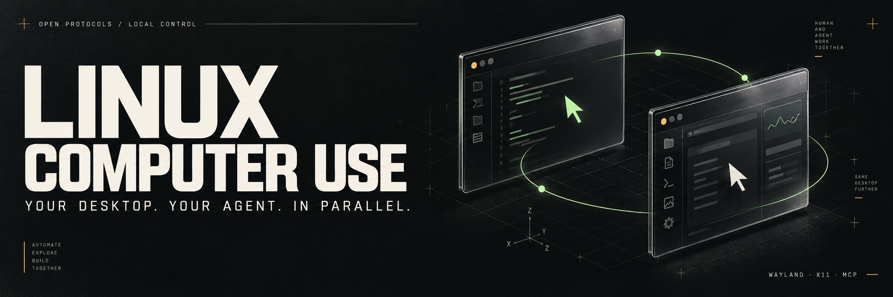
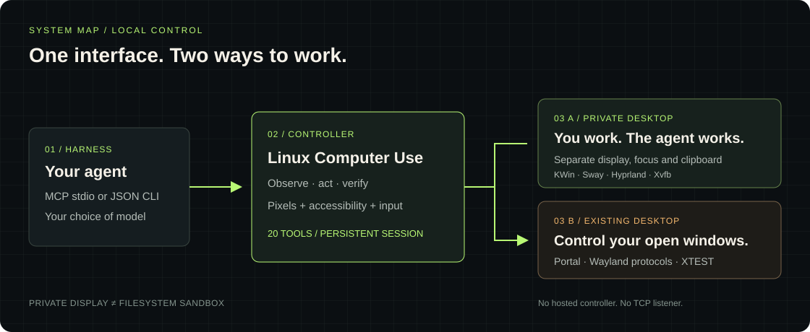
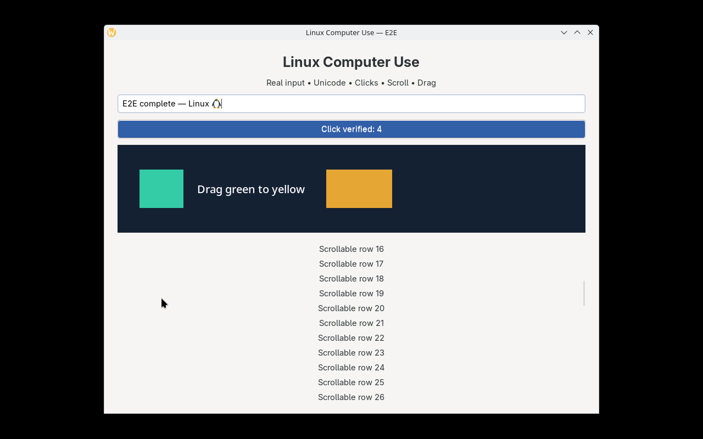
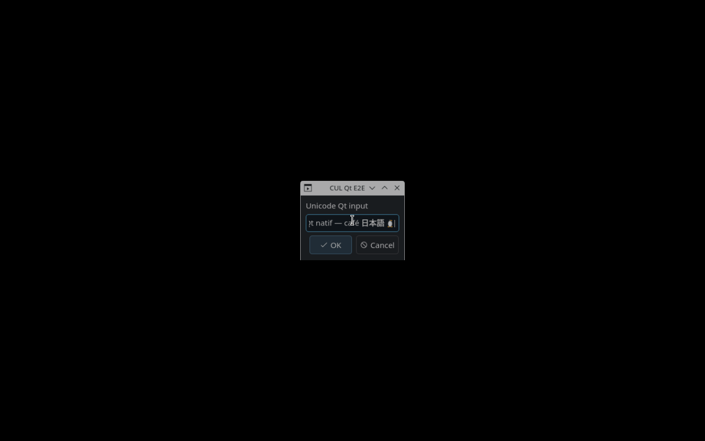
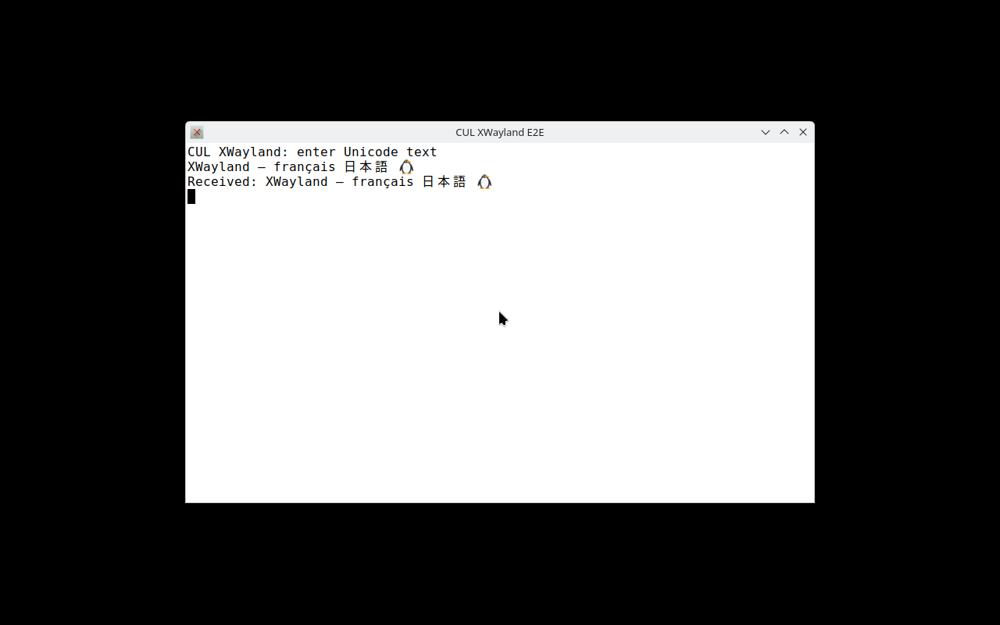

<p align="center">
  
</p>

<p align="center">
  <strong>Native Linux desktop control for the agent you choose.</strong><br>
  Screenshots. Accessibility. Mouse and keyboard. A desktop of its own.
</p>

<p align="center">
  <a href="#start-in-two-minutes">Install</a> ·
  <a href="#give-your-agent-a-desktop">Connect your agent</a> ·
  <a href="#tested-on-real-desktops">Evidence</a> ·
  <a href="docs/OMARCHY.md">Omarchy</a> ·
  <a href="docs/README.fr.md">Français</a>
</p>

<p align="center">
  <a href="LICENSE"></a>
  
  
  
</p>

---

An AI agent should be able to use Linux applications through the same interface you do. **Linux Computer Use** gives it a persistent native desktop connection, visual observations, semantic accessibility actions, and precise input through **20 tools shared by MCP and a JSON CLI**.

Its defining feature is a **private desktop**: the agent gets its own compositor, screen, input, clipboard, and session bus. You keep working on your desktop while it works in its own applications. For tasks in your existing windows, switch to current-desktop mode.

<table>
<tr>
<td width="33%" valign="top"><strong>01 / WORK IN PARALLEL</strong><br><br>Independent desktop sessions with KWin, Sway, Hyprland or Xvfb. Separate focus and clipboard. Crash cleanup built in.</td>
<td width="33%" valign="top"><strong>02 / SEE AND ACT</strong><br><br>Native capture, AT-SPI accessibility, Unicode input and frame-aware coordinates. Verify the application’s response after an action.</td>
<td width="33%" valign="top"><strong>03 / CHOOSE YOUR STACK</strong><br><br>Use your model and harness. Standard MCP over stdio or a local Unix socket. No model SDK, API key or hosted control service required.</td>
</tr>
</table>

> **Preview, with real evidence.** The initial validation passed 13 E2E reports on SteamOS and private/containerized Linux desktops. The universal installer has additional tests. Validation on the intended **Omarchy workstation is still pending**. See the [support matrix](#tested-on-real-desktops) before choosing a mode.

## Start in two minutes

Clone this repository using an account that has access while it is private:

```sh
git clone https://github.com/NuCl34R/computer-use-linux.git
cd computer-use-linux
./install.sh --dry-run
./install.sh
~/.local/bin/linux-computer-use doctor
```

The installer detects the distribution family, desktop, Wayland/X11 session, architecture, Omarchy markers, immutable systems, native libraries, compositors and Podman. It chooses a runtime using the capabilities actually present. **Run it as your normal user.** System Python 3.10+ is the bootstrap requirement.

On the validated SteamOS host, it selects the already installed native KWin runtime. No system packages or OS image changes are needed there.

<details>
<summary><strong>Native dependencies missing? Arch / Omarchy, Debian / Ubuntu, Fedora, openSUSE</strong></summary>

Review the plan, then explicitly allow the displayed package installation:

```sh
./install.sh --dry-run
./install.sh --install-deps
```

The package manager retains its normal confirmation prompt. On Arch/Omarchy, first bring the system up to date using your normal update procedure. The installer uses `pacman -S --needed`; it does not refresh sync databases, perform a partial upgrade or run a full OS upgrade for you.

Package recipes cover `pacman`, `apt-get`, `dnf` and `zypper`. They provide native libraries and a Sway private-desktop fallback. Package availability varies by release; the installer probes again after installation and reports missing capabilities. These recipes are not a claim of E2E certification on every distribution.

For Omarchy, start with [the dedicated workstation guide](docs/OMARCHY.md).

</details>

<details>
<summary><strong>Immutable desktop or a different Linux distribution? Use the container runtime</strong></summary>

With **rootless Podman** installed through your distribution’s supported method:

```sh
./install.sh --runtime container --build-container
~/.local/bin/linux-computer-use doctor
```

The first build downloads a complete graphical runtime; allow several minutes and several GB of storage. Later sessions reuse it. This creates a software-rendered Sway desktop that does not depend on the host DE or GPU.

SteamOS, Fedora Atomic variants, Bazzite, Bluefin, openSUSE transactional systems and NixOS are detected as image-based/declarative systems. The installer never unlocks their root filesystem or installs packages into their OS image. Existing complete native dependencies may still be used.

The container uses a read-only root, private temporary directories and a private home. It mounts the selected work directory read/write. Applications must be installed **inside the image** to run there. To control existing host windows, use the native runtime.

```sh
# Select exactly the directory your agent should work in.
export CUL_WORKDIR="$HOME/Projects/agent-work"
# Optional: enable network access for tasks that need it.
export CUL_NETWORK=host
~/.local/bin/linux-computer-use mcp
```

See [container operation and customization](docs/INSTALLATION.md#container-runtime).

</details>

<details>
<summary><strong>Other harnesses, custom paths, updates and removal</strong></summary>

```sh
./install.sh --harness claude
./install.sh --harness agents
./install.sh --skills-dir "$HOME/path/to/harness/skills"

# Keep verified backup archives and migrate old skill backup directories.
./install.sh --update

# Preview removal; use the same directory/harness options as installation.
./install.sh --uninstall --dry-run
./install.sh --uninstall
```

Default destinations are `~/.codex/skills/linux-computer-use`, `~/.local/bin/linux-computer-use` and an application identity under `~/.local/share/applications`. `--skills-dir`, `--bin-dir` and `--data-dir` override them. Updates keep private, verified backup archives under the data directory's `linux-computer-use/backups`, and migrate old skill backups so harnesses do not discover duplicates. No harness or shell configuration is rewritten. A manifest records the runtime and exact MCP configuration. Removal refuses modified files and preserves backups and container images.

If you install a second harness using the same launcher, use `--update`; the shared launcher then points to the latest installation. Use a separate `--bin-dir` and `--data-dir` for fully independent installs.

</details>

A checksummed source archive is also available in the [0.1.1 preview release](https://github.com/NuCl34R/computer-use-linux/releases/tag/v0.1.1). Extract it and run `./install.sh` from its directory; the installer does not require Git metadata.

## Give your agent a desktop

### MCP: one server, your choice of harness

The installer prints the exact configuration, including absolute paths. Add the server to your harness’s MCP settings using its supported configuration mechanism:

```json
{
  "mcpServers": {
    "linux-computer-use": {
      "command": "/home/YOUR_USER/.local/bin/linux-computer-use",
      "args": ["mcp"]
    }
  }
}
```

This is the common `mcpServers` format; some harnesses use TOML or a different settings layout. The command and arguments stay the same. The installed launcher selects native or container execution. The [portable skill](skills/linux-computer-use/SKILL.md) teaches the agent session selection, observation, coordinate rules and cleanup.

A useful first request:

> Use Linux Computer Use to open a new application in a private desktop. Inspect its visible state, enter some French text, verify the result with a fresh screenshot, and close the session when finished. Keep my personal desktop usable.

The agent’s loop is simple:

```text
start_session({"mode":"isolated"})
  → launch_app({"argv":["kdialog","--inputbox","Hello, Linux"]})
  → get_state()
  → act on an observed element or screenshot
  → get_state() to verify
  → stop()
```

Choose an application installed in the selected runtime. Reusing a running single-instance application may require its own profile or `--no-remote` equivalent.

| Tool group | Available tools |
| :--- | :--- |
| Session | `doctor`, `start_session`, `stop` |
| Observation | `get_state`, `screenshot`, `list_apps`, `list_windows` |
| Applications | `launch_app`, `focus_window` |
| Pointer | `move`, `move_relative`, `click`, `scroll`, `drag` |
| Keyboard | `press_key`, `type_text` |
| Accessibility | `focus_element`, `perform_action`, `set_value` |
| Coordination | `batch` |

Run `linux-computer-use tools` for authoritative schemas. MCP returns images as native content blocks, alongside structured metadata.

### JSON CLI: a persistent desktop from any process tool

No MCP support is required. Start the controller in one terminal or harness process:

```sh
cul_session=$(mktemp -d)
linux-computer-use serve --socket "$cul_session/control.sock" --mode isolated
```

Then call it from another terminal using the printed socket path:

```sh
linux-computer-use call launch_app --socket /PATH/TO/control.sock \
  --json '{"argv":["kdialog","--inputbox","Bonjour"]}'
linux-computer-use call get_state --socket /PATH/TO/control.sock \
  --image-out /tmp/agent-state.jpg
linux-computer-use call stop --socket /PATH/TO/control.sock
```

For literal multiline text, use `--json-file request.json`. The socket is mode `0600` in a `0700` directory and checks the connecting UID. For container sessions, prefer MCP; a CLI socket shared across container calls needs an explicitly shared location inside `/work`. See [the CLI guide](docs/INSTALLATION.md#cli-in-a-container).

## Two desktops, one machine



| | Private desktop · `isolated` | Existing desktop · `current` |
| :--- | :--- | :--- |
| Use it for | New app instances; concurrent work | Windows already on your screen |
| Human input | Independent cursor, focus and clipboard | Shared with the agent |
| Display backend | Owned KWin, Sway, Hyprland or Xvfb | KDE/GNOME portal, wlroots protocols or X11 |
| Consent | Creates a new owned desktop | Portal grant where required |
| Stopping | Closes the owned desktop and its apps | Releases control; leaves host apps running |
| File access | Native apps keep your user permissions | Your user permissions |

Private display separation is **not a filesystem or network sandbox**. Container mode narrows access to its configured mounts; the shared work directory remains writable. Read the [security model](SECURITY.md) for the exact boundary.

## Tested on real desktops

These are application-driven tests: actual GTK callbacks confirm text, clicks, scrolling and dragging. A successful screenshot alone does not count as successful control.

| Environment / path | Evidence | What this establishes |
| :--- | :--- | :--- |
| SteamOS 3.8.26 · native private KWin 6.4.3 | **Passed** | MCP, input, capture, AT-SPI, fresh frames, cancellation and cleanup |
| KDE RemoteDesktop portal · owned private KWin | **Passed** | Real portal consent, capture and input; physical desktop not exercised |
| Private Hyprland 0.56.2 · Arch container | **Passed** | Native Wayland input/capture with a compatible private parent and GPU render node |
| Private Sway 1.12 · rootless container | **Passed** | Complete desktop control with software rendering and no GPU |
| Xvfb · rootless container | **Passed** | X11 input, capture and accessibility |
| Qt + XWayland applications | **Passed** | kdialog and xterm with verified Unicode input |
| Two monitors · 125% scaling | **Passed** | Input mapping on a scaled, offset second display |
| Ubuntu 24.04 · private Sway + Xvfb | **Passed in GitHub Actions** | Full installed-skill MCP/GUI suites on an independent runner |
| Installer | **Passed locally** | Distribution routing, rollback, quoted paths, update/removal, native installed E2E |
| Omarchy workstation | **Pending** | Detection and Arch recipe implemented; physical machine test still required |
| GNOME / other host DEs / other atomic OS images | **Not individually certified** | Private runtime offers a portable route; current-desktop APIs vary |

The initial 13-report baseline also includes CLI transport, standalone skill installation, repeated accessibility-tree churn, and EOF/SIGTERM/SIGKILL cleanup. See [the validation record](docs/VALIDATION.md), [machine-readable baseline](skills/linux-computer-use/references/validation-results.json), [verified Ubuntu CI record](docs/ci-validation.json), and [CI runs](https://github.com/NuCl34R/computer-use-linux/actions).

<details>
<summary><strong>Open the real application captures</strong></summary>

**GTK test application after input, pointer and semantic actions**



**Native Qt dialog**



**XWayland terminal**



These are unmodified test captures. The masthead is generated artwork; it is not a screenshot of the product.

</details>

## Fast where it matters

Persistent connections avoid rebuilding the desktop session for every action. Native capture, bounded accessibility reads, and image-coordinate mapping keep the interaction loop short.

| Backend | Warm screenshot median | Screenshot p95 | Action → verified image median |
| :--- | ---: | ---: | ---: |
| KWin private, native SteamOS | **2.13 ms** | 2.47 ms | **53.83 ms** |
| KDE portal, private KWin | 2.15 ms | 2.34 ms | 53.07 ms |
| Hyprland private, container | 32.14 ms | 34.03 ms | 55.77 ms |
| Sway/Pixman, container | 16.15 ms | 32.10 ms | 50.44 ms |
| Xvfb, container | 16.46 ms | 17.00 ms | 50.20 ms |

**Method:** September 13, 2026 baseline; one SteamOS host; 1280×800, JPEG quality 85; 30 warm screenshot calls and five confirmed GUI changes per backend. Local MCP transport included; LLM inference excluded. PipeWire reads the latest available frame, while wlroots/X11 request a new capture, so the screenshot columns measure different capture paths. Action verification checks a changed post-action PNG and includes a 40 ms repaint allowance. [Full methodology and versions →](docs/VALIDATION.md)

These measurements characterize this implementation on that machine. **macOS/Windows performance parity has not been measured.**

## Built on Linux’s native interfaces

- **Wayland:** native protocols for virtual input, screencopy, clipboard and output geometry where advertised.
- **KDE:** private KWin capture/input; RemoteDesktop + ScreenCast portals for consented current-desktop use.
- **Accessibility:** AT-SPI trees, bounded queries, semantic actions and stale-reference detection. Screenshots cover apps without accessible controls.
- **X11:** persistent Xlib/XTEST connections. An XWayland `$DISPLAY` is never treated as full Wayland desktop access.
- **Lifecycle:** serialized actions, cancellation, input release and an independent guardian for controller-owned processes.
- **Transport:** stdio and same-user Unix sockets. No TCP listener or model-provider dependency.

[Architecture and native protocols →](skills/linux-computer-use/references/architecture.md)

## Know the boundaries

- Restart the session after display topology changes, or after `stop`.
- Use screenshot `frame_id` coordinates as returned; the engine handles scaling. Accessibility rectangles on Wayland are not always absolute screen coordinates.
- Check `after_action_frame`. A repeated or unavailable frame is not proof that an action succeeded.
- The existing-desktop mode shares the user’s focus and clipboard. Use private mode for simultaneous work.
- Nested Hyprland needs a compatible DMA-BUF parent and GPU render access. Use Sway/Pixman for software-only private sessions.
- The container’s base image is pinned; distribution packages are resolved at build time. Save the built image digest when exact reproduction matters.

[Troubleshooting and installation details →](docs/INSTALLATION.md)

## Project map

```text
install.sh                         Universal local entry point
scripts/install.py                 Detection, dependency plans, install/update/remove
skills/linux-computer-use/         Self-contained skill + native runtime + container recipe
tests/                             Real GUI tests and installer/transport contracts
docs/                              Setup, Omarchy validation, evidence and visual assets
.github/                           CI, issue forms and contributor workflow
```

| Continue here | |
| :--- | :--- |
| [Installation guide](docs/INSTALLATION.md) | Runtime choice, paths, containers and troubleshooting |
| [Omarchy workstation guide](docs/OMARCHY.md) | First run and repeatable acceptance test |
| [Validation record](docs/VALIDATION.md) | Evidence, methodology and reproducible commands |
| [Contributing](CONTRIBUTING.md) | Development setup and meaningful test expectations |
| [Security](SECURITY.md) | Permissions, isolation and vulnerability reporting |
| [Changelog](CHANGELOG.md) | What ships in this preview |

**Next milestone:** validate on the intended Omarchy workstation, record the results, then decide whether to make the repository public. A dedicated Omarchy integration is a later possibility, not part of the current installer.

## License

Code and documentation are licensed under [MIT](LICENSE). Native runtime libraries are supplied by the operating system.

<p align="center"><sub>OPEN PROTOCOLS / LOCAL CONTROL / YOUR DESKTOP, IN PARALLEL.</sub></p>
